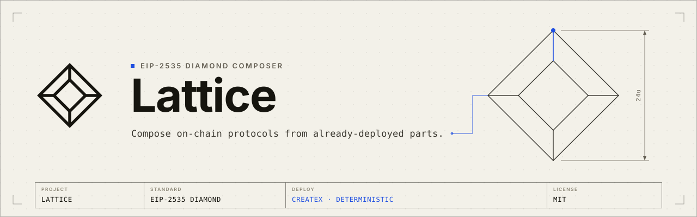

<p align="center">
  
</p>

# Lattice

Lattice is a Solidity library of modular contract modules built on top of the
[`diamond-lib`](https://github.com/dadadave80/diamond-lib) EIP-2535 Diamond Standard
framework. Most modules ship as a **stateless facet + a library with ERC-7201 namespaced
storage**, so they can be cut into a single Diamond proxy without storage collisions.

The core is an OpenZeppelin Contracts v5-style module set ported into the Diamond facet
pattern. The current tree also includes smart-account, cross-chain, DeFi adapter, oracle,
ENS, marketplace, privacy/ZK, and upgrade-governance modules. It is a Foundry project
consumed as a Forge dependency; there is no application or canonical deployment of its own.

## Status / disclaimer

> **Unaudited. Use at your own risk.** Lattice re-implements OpenZeppelin and adapts
> external protocol interfaces, account standards, bridge/oracle integrations, and ZK/privacy
> primitives. It has **not** been audited and carries no warranty. It has not received the
> review that the upstream libraries it mirrors or composes with have. Do not deploy it to
> mainnet with funds at risk without your own independent audit, especially modules that
> custody assets, verify proofs, bridge messages, or authorize upgrades. Licensed under MIT.

## Modules

| Area | Modules |
|------|---------|
| `access/` | `AccessControl`, `AccessControlEnumerable`, `AccessControlTimed`, `AccessManager` (+ `AccessManaged`, `AccessManagerStandalone`), `Ownable` |
| `accounts/` | Diamond smart-account building blocks — two modular-account flavors ([see below](#smart-account-flavors-erc-7579-and-erc-6900)), each in its own subfolder. **`accounts/erc7579/`:** `AccountDiamond`, `Account7702Diamond`, `AccountFactory`, `AccountInit`, `AccountSigner`, `ERC7821Executor`, `ERC7579ModuleConfig`. **`accounts/erc6900/`:** `ModularAccount6900`, `AccountFactory6900`, `AccountInit6900`, `ERC6900ModuleManager`, `ERC6900Executor`, `ERC6900Validation`, `ERC6900Signature`, `ERC6900AccountView` (+ reference modules `modules/SingleSignerValidation`, `modules/SpendingLimit`). **Shared base + standalone account types (`accounts/`):** `ERC4337Validation`, `ERC1271Signature` (the ERC-4337/1271 base both flavors build on), plus the single-facet standalone types `ERC6551Account` (token-bound) and `SessionKey` |
| `amm/` | `ConstantProduct` |
| `crosschain/` | **Message gateways:** `CCIPGatewayAdapter`, `AxelarGatewayAdapter`, `WormholeGatewayAdapter`, `LayerZeroGatewayAdapter`, `HyperlaneGatewayAdapter`, `ZetaChainGatewayAdapter` (hub-routed), `HyperbridgeGatewayAdapter` (proof-verified), `L2ToL2`/`L1ToL2CrossDomainMessengerGatewayAdapter` (OP). **Token rails:** `CCTPBridgeAdapter` (burn/mint), `AcrossBridgeAdapter` (intent), `StargateBridgeAdapter` (pooled), `BridgeERC20`, `BridgeERC7802`, `SuperchainETHBridgeAdapter`. **Non-EVM:** `StarknetGatewayAdapter` (felt252, L1↔L2). **Composition:** `ERC7786OpenBridge` (M-of-N), `CrosschainLink`, `ChainRegistry` (one-action fan-out), `CrosschainTimelockHandler`. See [`CROSSCHAIN.md`](CROSSCHAIN.md) for the adapter-shape reference + off-chain dependency matrix |
| `defi/` | `AaveV3Adapter`, `AggregatorExecAdapter`, `CompoundV3Adapter`, `CurveStableSwapAdapter`, `ERC4626Adapter`, `GovernedVault`, `LidoAdapter`, `StrategyManager`, `UniswapV3Adapter`, `VaultCore`, `WETHUnwrapper` |
| `ens/` | `ENSResolver`, `ENSReverseClaimer`, `ENSSubnameIssuer` |
| `governance/` | `Governor` (+ `GovernorStandalone`), `TimelockController` (+ `TimelockControllerStandalone`), `Votes`, `GovernedDiamondCut`, `SafeDiamondCut`, `GovernedSafeDiamondCut`, `SafeHarborAdopter` |
| `oracles/` | `API3Adapter`, `API3QRNGAdapter`, `BandAdapter`, `ChainlinkAdapter`, `ChainlinkAutomationAdapter`, `ChainlinkCREAdapter`, `ChainlinkVRF`, `ChronicleAdapter`, `DIAAdapter`, `GelatoAutomateAdapter`, `GelatoVRFAdapter`, `PythAdapter`, `PythEntropyAdapter`, `RedStoneAdapter`, `TWAPOracle`, `TellorAdapter` |
| `privacy/` | `CommitReveal`, `ERC5564Announcer`, `ERC6538Registry`, `Groth16Verifier`, `PlonkVerifier`, `PrivateVoting`, `Semaphore`, `ShieldedPool` |
| `security/` | `Pausable`, `ReentrancyGuard`, `RateLimiter`, `CircuitBreaker`, `EmergencyStop`, `InvariantChecker` |
| `tokens/` | One subfolder per standard (base + extensions flat inside, `<std>/libraries/` for logic). **`tokens/ERC20/`:** `ERC20` (+ `Burnable`, `Capped`, `Crosschain`, `Permit`, `Votes`). **`tokens/ERC721/`:** `ERC721` (+ `URIStorage`). **`tokens/ERC1155/`**, **`tokens/ERC2981/`**, **`tokens/ERC4626/`**, **`tokens/ERC7802/`**. `MarketplaceZone` sits at the `tokens/` root (a Seaport zone enforcing the issuer's own token policy, not a token standard) |
| `utils/` | `EIP712`, `Multicall`, `Nonces`, `VestingWallet` (+ `VestingWalletStandalone`) |

**Utility libraries** (`src/utils/libraries/`) — pure logic with no own storage, facet,
or interface: `Base64`, `Bytes`, `Calldata`, `Checkpoints`, `ECDSA`, `EnumerableSet`,
`InterestRate`, `InteroperableAddress`, `P256`, `Panic`, `ShortStrings`,
`SignatureChecker`, `Strings`, `TimelockLib`, `UniswapV3FullRangeMath`, `WebAuthn`, plus
module helpers such as `EIP712Lib`, `MulticallLib`, `NoncesLib`, and `VestingWalletLib`.

`src/interfaces/external/` vendors minimal third-party ABIs used by adapters and standards
integrations, grouped per vendor (`circle/`, `chainlink/`, `layerzero/`, …; pure ERC/EIP standard
interfaces under `ercs/`). The canonical storage/interface registry is
[`STORAGE_REGISTRY.md`](STORAGE_REGISTRY.md), and
`test/unit/StorageSlotVerificationTest.t.sol` re-derives every registered slot and checks
global uniqueness.

## Smart-account flavors: ERC-7579 and ERC-6900

Lattice ships **two modular smart-account flavors**, both built on the shared Diamond core
(DiamondCut / Loupe / ERC-165 / AccessControl). They are **separate blueprints** — you pick one
per account; the two facet sets are never cut into the same Diamond. Both target ERC-4337 and
ERC-1271, and both are written fresh in the three-layer facet pattern (the ERC-6900 reference
implementation is GPL and is **not** a dependency — only minimal interfaces are vendored into
`src/interfaces/external/`).

- **ERC-7579** (`AccountDiamond` proxy) — the four fixed module types (validator 1, executor 2,
  fallback 3, hook 4). A per-op validator is selected by the top 20 bytes of `userOp.nonce`; one
  global hook wraps execution; a fallback registry is layered under the facet map.
- **ERC-6900** (`ModularAccount6900` proxy) — inspired by EIP-2535 itself, so it maps onto the
  Diamond most naturally. Validation is a richer `ModuleEntity` (`address ‖ uint32 entityId`)
  with per-validation pre-validation hooks and per-selector pre/post execution hooks — the
  standardized form of a session-key permission. Execution modules are dispatched by **CALL** (so
  they run in their own storage), layered under the facet map.

| Dimension | ERC-7579 | ERC-6900 |
|---|---|---|
| Proxy | `AccountDiamond` | `ModularAccount6900` |
| Factory / init | `AccountFactory` / `AccountInit` | `AccountFactory6900` / `AccountInit6900` |
| Module identity | module address (per type) | `ModuleEntity` = `address ‖ uint32 entityId` |
| Module kinds | 4 fixed types | validation / validation-hook / execution / execution-hook modules |
| userOp validator selection | top 20 bytes of `userOp.nonce` | first 24 bytes of `userOp.signature` |
| Validation scope | by module type | global (per-selector opt-in) **or** a per-selector allowlist |
| Hooks | one global pre/post hook | per-validation pre-validation hooks + per-selector pre/post exec hooks |
| Execution extension | fallback handlers (CALL or DELEGATECALL) | execution-function registry, dispatched by CALL (own storage) |
| Session-key permissions | `SessionKey` library (ad hoc) | a validation + attached hooks (standardized) |
| Introspection | `DiamondLoupe` | `IERC6900AccountView` (`getExecutionData` / `getValidationData`) |
| Config authority | account-self or admin | account-self or admin (config is admin-gated, not validation-gated) |

The ERC-6900 facets: `ERC6900ModuleManager` (install/uninstall validations + executions),
`ERC6900Executor` (`execute` / `executeBatch` / `executeWithRuntimeValidation` plus the proxy's
execution-module dispatch), `ERC6900Validation` (ERC-4337 `validateUserOp`), `ERC6900Signature`
(ERC-1271, ERC-7739-bound to the account's domain so signatures can't be replayed across
accounts), and `ERC6900AccountView` (the loupe). Reference modules `SingleSignerValidation` and
`SpendingLimit` demonstrate the validation and execution-hook module shapes.

## Architecture: three-layer facet pattern

Diamond facets must be **stateless** — proxy state lives in the Diamond, not the facet —
so facet modules are split into three files with strict responsibilities:

```
src/interfaces/<area>/IFoo.sol # ABI, custom errors, events. Wide pragma (>=0.8.4)
        ▲                       # interfaces mirror the module's <area> folder
src/<area>/libraries/FooLib.sol # ALL logic + ERC-7201 storage + __Foo_init(...)
        ▲                       # storage read via a single FooStorage() -> hardcoded slot
src/<area>/Foo.sol              # stateless facet: virtual fns that forward to FooLib
```

```solidity
// src/<area>/Foo.sol — facet: no state, no logic, just delegation
contract Foo is IFoo {
    function bar(uint256 x) external virtual returns (uint256) {
        return FooLib.bar(x);
    }
}
```

A handful of **utility libraries** (see above) skip this split: they are pure logic with
no own ERC-7201 slot, no interface file, and no facet — the consuming module owns any
storage struct they operate on. A few contracts are standalone rather than facets where the
standard or deployment model requires it, for example `AccountFactory`, `GovernorStandalone`,
`TimelockControllerStandalone`, `AccessManagerStandalone`, and `VestingWalletStandalone`.

## Install / usage

ENS grant Milestone 3 provides the [documentation quickstart](docs/guides/quickstart.md)
and [reusable storage-layout Action](.github/actions/storage-layout/README.md).
These are draft deliverables under review in [#177](https://github.com/dadadave80/lattice/issues/177).

Install as a Forge dependency:

```sh
forge install dadadave80/lattice
git submodule update --init --recursive   # diamond-lib + forge-std submodules
```

Add the remappings (mirror of this repo's `remappings.txt` / `foundry.toml`):

```
@lattice/=lib/lattice/src/
@diamond/=lib/diamond-lib/src/
forge-std/=lib/forge-std/src/
```

Because facets have no constructors, proxy state is set up through Lattice's vendored
`Initializable` mixin over `InitializableLib` (both moved into Lattice at diamond-lib v0.3.0).
Inherit the mixin and guard the init entrypoint with the `initializer` modifier — it wraps the body
in `preInitializer()`/`postInitializer(slot)`, so nested constructor-initializers finalize exactly
once. `reinitializer(version)` and `onlyInitializing` are available for upgrades and init-only
helpers:

```solidity
import {AccessControl} from "@lattice/access/AccessControl.sol";
import {AccessControlLib} from "@lattice/access/libraries/AccessControlLib.sol";
import {Initializable} from "@lattice/utils/Initializable.sol";

contract MyAccessControlled is AccessControl, Initializable {
    function initialize(address _admin) external initializer {
        AccessControlLib.__AccessControl_init(_admin); // module init (gated by checkInitializing)
    }
}
```

Note: init contracts delegatecalled during `diamondCut` (the `*Init.sol` pattern) carry NO guard of
their own — they already run inside `Lattice.initialize`'s `initializer` scope, and a nested
guard reverts outside a constructor context.

When adding new modules, be deliberate about caller semantics. Some existing modules use
`msg.sender` directly because they authenticate protocol callbacks, Safe calls, EntryPoint
calls, or Diamond self-dispatch. If a module is intended to support forwarded calls, use the
project's established caller-resolution pattern consistently through the library layer.

## Live testnet deployment (Sepolia)

A reference deployment of the self-governed, ENS-named ERC-4626 vault recipe
([`DeployGovernedVaultENS`](script/base/defi/DeployGovernedVaultENS.s.sol)) — one diamond hosting the
share token, vault, vote checkpoints, Governor, TimelockController, EmergencyStop, and a governed
upgrade path, with **no external admin**: the diamond administers itself, so a passed, timelock-executed
shareholder proposal is the only way to upgrade or reconfigure it.

| | |
|---|---|
| Diamond (vault) | [`0x7a498c34A8Dc3B6502889C21218Da0F8696b7bb6`](https://sepolia.etherscan.io/address/0x7a498c34a8dc3b6502889c21218da0f8696b7bb6#code) |
| Primary ENS name | [`milestone1vault.lattice.studio.eth`](https://sepolia.app.ens.domains/milestone1vault.lattice.studio.eth) (forward + reverse) |
| Underlying asset | [`TestnetAsset`](https://sepolia.etherscan.io/address/0x9383f665dff7529f6c28e732ec4136d332fa43c9#code) (open faucet: `mint(address,uint256)`) |

All 14 facets are source-verified on Etherscan:
[ERC165Facet](https://sepolia.etherscan.io/address/0xddd97e17031bfb32c3428f13a44eb0449bf4ac62#code) ·
[AccessControl](https://sepolia.etherscan.io/address/0xf45d5e8bc4ad61059434983edab44963ccd0570d#code) ·
[TimelockController](https://sepolia.etherscan.io/address/0x894507f901ffe88fb9ff7ebe8edaecb2b959da10#code) ·
[ERC20](https://sepolia.etherscan.io/address/0x58e1f0d2ad3d94011c765adf0508dd588e3a7397#code) ·
[ERC4626](https://sepolia.etherscan.io/address/0xcc2b1ff44ac9bd105448c3346c571f8cc6ad1c04#code) ·
[VaultCore](https://sepolia.etherscan.io/address/0xecf68bd66e8457ceeee826bb5ab8040d36d2056f#code) ·
[Votes](https://sepolia.etherscan.io/address/0x3e698cce280af053bf6bf3f61edfe4f75e2d77fe#code) ·
[ERC20Votes](https://sepolia.etherscan.io/address/0x6db23df1319b12b2f8f36e78ccc409a6acbab56d#code) ·
[Governor](https://sepolia.etherscan.io/address/0x50c36f0eaeec1e3fa6d5f4212067aaa9c9e0b938#code) ·
[GovernedVault](https://sepolia.etherscan.io/address/0x27bcd5beff0594ff3abf4f27eeeb176f5f6d442b#code) ·
[DiamondLoupeFacet](https://sepolia.etherscan.io/address/0x983c1f18254af7f0c998a6f24699f17c5d1d2ab1#code) ·
[EmergencyStop](https://sepolia.etherscan.io/address/0xce342fdcade10e9571b8e249faa1f043cd0dd7e5#code) ·
[GovernedDiamondCut](https://sepolia.etherscan.io/address/0xc4eb702847dac1f636cee9c06dc125f132f49183#code) ·
[ENSReverseClaimer](https://sepolia.etherscan.io/address/0x91dfa8a2ee39ba605cb1633e46c8598d1649cc38#code) ·
(init: [GovernedVaultENSInit](https://sepolia.etherscan.io/address/0x58147df75c453c269ade1b18270505c1b5dc91d0#code))

Reproduce against any fresh testnet in one command (asset `0x0` auto-deploys a faucet asset; the diamond
claims its ENS reverse record at init):

```sh
forge script script/base/defi/DeployGovernedVaultENS.s.sol --tc DeployGovernedVaultENS \
  --rpc-url sepolia --account <keystore> --broadcast \
  --sig "run(((address,string,string,uint8,uint256,uint48,uint32,uint256,uint256),address,string))" \
  "((0x0000000000000000000000000000000000000000,\"Governed Vault Share\",\"gVLT\",0,300,60,600,0,4),<ReverseRegistrar>,\"<name>\")" \
  --verify --etherscan-api-key "$ETHERSCAN_API_KEY"
```

The broadcast run log for this deployment is committed at
[`broadcast/DeployGovernedVaultENS.s.sol/11155111/run-latest.json`](broadcast/DeployGovernedVaultENS.s.sol/11155111/run-latest.json).

After deployment the diamond **governed itself on-chain**: a shareholder proposal — deposit → propose →
vote → timelock queue → execute — froze the loupe/cut selector set and reasserted the ENS name through the
diamond's own Governor + TimelockController, with every step cranked by
[`script/config/governance-demo-loop.sh`](script/config/governance-demo-loop.sh). Execution proof:
[`ProposalExecuted` tx](https://sepolia.etherscan.io/tx/0xfba2c57a3063883b43edb905fabcbe508c3ff9d3f0447d2d58fa2739c832df64)
(run log: [`governanceDemo-latest.json`](broadcast/DeployGovernedVaultENS.s.sol/11155111/governanceDemo-latest.json)).

## Live cross-chain USDC demos (Circle CCTP v2 · Arc testnet)

Three live demos drive real USDC through Lattice diamonds with Circle's CCTP v2, with **Arc testnet
as the source chain** — Arc's sub-second finality means Iris attests in seconds, not minutes:

- **Arc-hub transfer** (`make demo-cctp`): one hub diamond on Arc burns USDC toward BOTH
  destinations (Ethereum Sepolia + Base Sepolia); each attested message is relayed and minted on the
  destination. One command per run: setup → burn → attest → relay → verify, unattended.
- **Hook showcase** (`make demo-cctp-hook`): programmable USDC. A burn on Arc carries the Lattice
  hook envelope (`HOOK_MAGIC ‖ vault ‖ beneficiary`); relaying on Base Sepolia through the
  destination diamond's `relayMessageWithHook` mints to a [`CCTPHookVault`](src/examples/crosschain/CCTPHookVault.sol)
  **and**, in the same tx, the diamond's `CCTPHookExecutor` credits the beneficiary — one attested
  message both moves funds and executes logic.
- **Position-style receipt NFT** (`make demo-cctp-receipt`): USDC is minted directly to the Base
  recipient while the same attested relay mints a fully on-chain [`CCTPHookReceipt`](src/examples/crosschain/CCTPHookReceipt.sol)
  showing the net amount, CCTP source domain, source contract, original recipient, route, and delivery
  time. The transferable NFT is immutable proof of delivery — it never custodies, controls, or redeems
  the USDC.
- **Round trip** (`make demo-cctp-roundtrip`): USDC moves Arc → Base **and back**, through Lattice
  diamonds on both ends of both legs. Outbound attests in seconds (Arc finality); the return leg
  attests after Base Sepolia's L1 finality (~13–19 min on the free tier — the run journal makes
  Ctrl-C safe, re-run to resume). The return mint into Arc is `cast`-sent through the hub's
  `relayMessage`: the Arc node executes the native-USDC precompile that local simulation cannot.

| | |
|---|---|
| Arc source hub (transfer demo) | [`0xfc937CD3d175b890fF668f95fdED5CB4D9247d68`](https://testnet.arcscan.app/address/0xfc937CD3d175b890fF668f95fdED5CB4D9247d68) |
| Mint tx — Ethereum Sepolia | [`0xff2326…39aea`](https://sepolia.etherscan.io/tx/0xff2326eb12dfd5b56e553e43f660e0c0cc8bba01dbc215b12109bf05c8039aea) |
| Mint tx — Base Sepolia | [`0xf72700…736d3`](https://base-sepolia.blockscout.com/tx/0xf7270031cb59c1ff0c85fc0147768a623b69a7d2a3c12faa4b1d4ded9fc736d3) |
| Hook demo — Arc hub diamond | [`0x6ca99B6179eAc891E3aCD4008b610fcE66F63E2d`](https://testnet.arcscan.app/address/0x6ca99B6179eAc891E3aCD4008b610fcE66F63E2d) |
| Hook demo — Base destination diamond | [`0x957259C5AEAa521c9DcFaEb6692C25ae53F349f1`](https://base-sepolia.blockscout.com/address/0x957259C5AEAa521c9DcFaEb6692C25ae53F349f1) |
| Auto-credit vault (`CCTPHookVault`) | [`0xe8e10843Ab41B2c359D02eA091b6772C43b05b1f`](https://base-sepolia.blockscout.com/address/0xe8e10843Ab41B2c359D02eA091b6772C43b05b1f) |
| Burn-with-hook tx (Arc) | [`0xc9ba15…a77a4`](https://testnet.arcscan.app/tx/0xc9ba159c51f027ab336d56b054a5947be02f8d2ba398ffd304ffbbaf0e5a77a4) |
| Relay tx — mint **+** hook, one tx (Base) | [`0x7f82f3…b5d00`](https://base-sepolia.blockscout.com/tx/0x7f82f3c2128bf6026b340cbb1265ca5d5182de076d55d35a2223114ce09b5d00) — emits `Credited(0x11Cf…eC00, 1000000, 26, hub)` |
| Real-attestation replay test | [`test/fork/CCTPHookDemoFork.t.sol`](test/fork/CCTPHookDemoFork.t.sol) replays the captured [fixture](test/fixtures/cctp/arc-to-base-hook-v2.json) through the live Base diamond on a pinned fork |
| Receipt NFT (`CCTPHookReceipt`) | [`0x6De791…71a65`](https://base-sepolia.blockscout.com/address/0x6De7919B31b5FCBC771baD221B7A305F43871a65) |
| Receipt demo burn (Arc) | [`0x7a923b…c6f07`](https://testnet.arcscan.app/tx/0x7a923bb854ea4e172cbb452d16cf5c1ff75765189c73f3e36d45ed65bf8c6f07) |
| Receipt relay — direct USDC + NFT (Base) | [`0xbdcd52…5a8a7`](https://base-sepolia.blockscout.com/tx/0xbdcd52bb632dd2f2d031da3ba55ac421ad73b0cf3cf3f679047cfa51d5e5a8a7) — grant-video run; mints 5 USDC and receipt #4 to `0xDAda…C751` |
| Receipt real-attestation replay | [`test/fork/CCTPHookReceiptDemoFork.t.sol`](test/fork/CCTPHookReceiptDemoFork.t.sol) replays the captured [receipt fixture](test/fixtures/cctp/arc-to-base-receipt-v2.json) |
| Broadcast evidence | [`broadcast/multi/`](broadcast/multi) (setups) · [`broadcast/CCTPHookDemo.s.sol/84532/`](broadcast/CCTPHookDemo.s.sol/84532) (hook relay) · [`broadcast/CCTPUSDCDemo.s.sol/`](broadcast/CCTPUSDCDemo.s.sol) (transfer relays) |

All demo contracts are Sourcify-verified (`exact_match`) on both chains.

**Anyone can run the hook demo** — deployment is separate from the demo, and by default it runs
against the live contracts above, so all you need is a funded signer: Arc testnet USDC (the asset
AND Arc's gas token, from https://faucet.circle.com) plus a little Base Sepolia ETH for relay gas
(any Base Sepolia faucet):

```sh
make demo-cctp-hook PRIVATE_KEY=0x<testnet-key>   # or KEYSTORE=<foundry-keystore-name>
```

The receipt demo is intentionally separate from the vault demo. Deploy its NFT once against the existing
Base destination diamond, then run it directly or choose **Receipt NFT** inside `make demo`:

```sh
make deploy-cctp-receipt PRIVATE_KEY=0x<testnet-key>
make demo-cctp-receipt PRIVATE_KEY=0x<testnet-key>
```

`CCTPHookReceipt` renders its JSON and SVG entirely on-chain. Its `source contract` field is Circle's
attested CCTP message sender (normally the Arc hub diamond), not an asserted source-user wallet. The live
deployment and first receipt relay are linked in the evidence table above.

To deploy your **own** stack instead (once — ONE deployment serves ALL the demos: the Arc hub is
registered for Ethereum Sepolia and Base Sepolia, `make demo-cctp` adopts it as its transfer hub,
`make demo-cctp-hook` gets its hub + diamond + vault, and the Base diamond carries the Arc return
registration `make demo-cctp-roundtrip` burns back through):

```sh
make deploy-cctp PRIVATE_KEY=0x<testnet-key>
```

See the [Makefile](Makefile) demos section for the full auth matrix (`KEYSTORE=` / `PRIVATE_KEY=` /
raw `FORGE_AUTH=`).

## Build & test

```sh
forge build                                    # compile
forge test                                     # run all tests
forge test --match-contract AccessControl -vvv # verbose, by contract
forge test --match-contract StorageSlotVerificationTest # verify ERC-7201/ERC-165 slots
forge fmt                                       # format (CI runs `forge fmt --check`)
forge snapshot                                  # gas snapshots
```

The suite currently includes unit, integration, fork, fuzz, invariant, and gas tests. CI
runs with `FOUNDRY_PROFILE=ci` (`optimizer_runs = 1_000_000`, `via_ir = false`). A green
local `forge test` does not guarantee CI passes if optimizer behavior diverges — run
`FOUNDRY_PROFILE=ci forge build --sizes` before pushing if you touch hot paths.

## Layout

```
src/
├── access/        # AccessControl(+Enumerable,+Timed), AccessManager(+Managed,+Standalone), Ownable
├── accounts/      # Diamond smart accounts — erc7579/ & erc6900/ flavor subfolders + shared (ERC-4337/1271/6551, session keys)
├── amm/           # ConstantProduct
├── crosschain/    # per-vendor adapter folders (circle/, layerzero/, …), each self-contained (facet+Init+Lib); generic modules at root, shared libs in libraries/
├── defi/          # Aave, Compound, Curve, Lido, Uniswap V3, ERC4626 adapters, AggregatorExec, GovernedVault, WETHUnwrapper
├── ens/           # ENS resolver, reverse claimer, subname issuer
├── governance/    # Governor, timelock, governed/Safe diamond cuts, Safe Harbor adoption
├── oracles/       # per-vendor adapter folders (chainlink/, pyth/, redstone/, …, uniswap/ TWAP), each self-contained (facet+Init+Lib)
├── privacy/       # Commit-reveal, stealth address standards, Groth16/PLONK, Semaphore, shielded pool
├── security/      # Pausable, ReentrancyGuard, RateLimiter, CircuitBreaker, EmergencyStop, InvariantChecker
├── tokens/        # per-standard subfolders ERC20/ ERC721/ ERC1155/ ERC2981/ ERC4626/ ERC7802/ (base+extensions); MarketplaceZone at root
├── utils/         # EIP712, Multicall, Nonces, VestingWallet(+Standalone)
│   └── libraries/ # Crypto, encoding, strings, checkpoints, math, multicall/nonces/vesting helpers
└── interfaces/    # I<Module>.sol mirrored into per-<area> subfolders
    └── external/  # vendored third-party ABIs, one folder per vendor (circle/, chainlink/, …, ercs/)
```

Each `<area>/` also contains a `libraries/` subfolder holding the `<Module>Lib.sol`
logic libraries for that area.

## License

MIT
