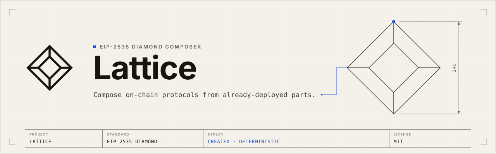

<p align="center">
  
</p>

# Lattice

[](https://github.com/dadadave80/lattice/actions/workflows/test.yml)

Lattice is a Solidity library of modular contract modules built on top of the
[`diamond-lib`](https://github.com/dadadave80/diamond-lib) EIP-2535 Diamond Standard
framework. Most modules ship as a **stateless facet + a library with ERC-7201 namespaced
storage**, so they can be cut into a single Diamond proxy without storage collisions.

The core is an OpenZeppelin Contracts v5-style module set ported into the Diamond facet
pattern. The current tree also includes smart-account, cross-chain, DeFi adapter, oracle,
ENS, marketplace, privacy/ZK, and upgrade-governance modules. It is a Foundry project
consumed as a Forge dependency; there is no application or canonical deployment of its own.

## Status / disclaimer

> **Unaudited. Use at your own risk.** Lattice re-implements OpenZeppelin and adapts
> external protocol interfaces, account standards, bridge/oracle integrations, and ZK/privacy
> primitives. It has **not** been audited and carries no warranty. It has not received the
> review that the upstream libraries it mirrors or composes with have. Do not deploy it to
> mainnet with funds at risk without your own independent audit, especially modules that
> custody assets, verify proofs, bridge messages, or authorize upgrades. Licensed under MIT, except
> files whose SPDX header says otherwise; see [`LICENSES/`](LICENSES/) and [`lib/VENDORED.md`](lib/VENDORED.md).

## Install / usage

Install as a Forge dependency, pinned to a release tag. The steps below assume a git repository
(`forge init` creates one). In a `--no-git` project, run `forge install --no-git
dadadave80/lattice@<tag>` instead and skip the commit step and the `git describe` check below: Forge
records no gitlink, so check the pin from `VERSION` in `lib/lattice/src/LatticeVersion.sol`. CI builds with
Foundry v1.8.5 and Solidity 0.8.36, and these steps were checked on Forge v1.8.5.

<!-- x-release-please-start-version -->
```sh
forge install dadadave80/lattice@v0.4.0
git add lib/lattice .gitmodules foundry.lock && git commit -m "Install lattice"
```
<!-- x-release-please-end -->

`forge install` checks out the tag and its nested `diamond-lib` and `forge-std` submodules. Commit the
install straight away, as shown: some Forge releases stage the default branch's commit rather than the
tag's, and a later `git submodule update` then moves `lib/lattice` off the tag. Check the pin with
`git -C lib/lattice describe --tags --exact-match`. Install from a tag, never the default branch: `main`
and `dev` can carry unreleased changes (see [Versioning and compatibility](#versioning-and-compatibility)).

No remappings are needed: Forge reads `lib/lattice/remappings.txt` and derives `@lattice/` and
`@diamond/` itself. If you keep your own `remappings.txt`, map both into the dependency:

```
@lattice/=lib/lattice/src/
@diamond/=lib/lattice/lib/diamond-lib/src/
forge-std/=lib/forge-std/src/
```

Facets have no constructors, so a diamond's state is seeded by an init contract that
`Lattice.initialize` delegatecalls once, inside its `initializer` window. Write it like the shipped
`*Init.sol` contracts (for example [`AccessControlInit`](src/access/AccessControlInit.sol)): a plain
`init` with **no** `initializer` modifier, calling each module's `__<Module>_init` in dependency order.

```solidity
import {AccessControlLib} from "@lattice/access/libraries/AccessControlLib.sol";

contract MyAppInit {
    function init(address admin) external {
        AccessControlLib.__AccessControl_init(admin); // passes: initialize's window is open
        // ...other module inits, in dependency order
    }
}
```

The `*Init` contracts carry no guard of their own because they already run inside
`Lattice.initialize`'s `initializer` scope; a nested guard reverts outside a constructor context. The
vendored `Initializable` mixin also provides `reinitializer(version)` and `onlyInitializing` for
upgrade-time init contracts.

Deploy and initialize in **one transaction** through `LatticeFactory.deploy(entries, customCuts, init,
initCalldata, salt)`. The recipe must cut the diamond loupe, or the factory reverts. Never deploy a
Lattice proxy and call `initialize` in a separate transaction: `initialize` is first-caller-wins, so
anyone who sees the deployment can initialize it first with their own cut and take the diamond. The
[Compose your own Diamond](docs/guides/compose-your-own-diamond.md#initialize-in-one-transaction) guide
walks through a full recipe with `deployAtomic`.

Every `script/base/**` recipe creates and initializes its diamond in one transaction through
`LatticeFactory`. By default a run first deploys its own `LatticeRegistry` + `LatticeFactory`. Set
`LATTICE_FACTORY=<address>` to reuse a deployed factory, such as a release factory (a committed per-chain
release manifest is tracked in [#196](https://github.com/dadadave80/lattice/issues/196)). Set
`LATTICE_SALT=<0x + 64 hex characters>` to choose addresses: diamond `i` of a run lands at
`factory.predict(<broadcaster>, keccak256(abi.encode(LATTICE_SALT, i)))`. Re-running with a salt that is
already used reverts before anything is broadcast.

**Worked example: governance-upgradeable diamond (runs in CI).** The
[example](examples/governance-upgradeable-diamond/README.md) composes an ERC-4626 vault diamond that can
only be upgraded by a proposal passed through its own Governor and TimelockController, and the
[Compose your own Diamond](docs/guides/compose-your-own-diamond.md) guide explains each step of that
composition. Deploy and run it with `make example-ens-grant-m2 RPC=<alias-or-URL> KEYSTORE=<name>`, or on
local Anvil with `make example-ens-grant-m2 LOCAL=1`. Grant milestone evidence is in
[PROGRESS.md](PROGRESS.md).

When adding new modules, be deliberate about caller semantics. Some existing modules use
`msg.sender` directly because they authenticate protocol callbacks, Safe calls, EntryPoint
calls, or Diamond self-dispatch. If a module is intended to support forwarded calls, use the
project's established caller-resolution pattern consistently through the library layer.

## Modules

| Area | Modules |
|------|---------|
| Core (`src/` root) | `Lattice` (the diamond proxy; its `initialize` is first-caller-wins, so create and initialize it in one transaction), `LatticeFactory` (stateless CREATE2 factory that deploys and initializes a diamond atomically; a repeat `deploy` with the same sender and salt returns the existing diamond and ignores the new recipe, so use one salt per recipe), `LatticeRegistry` (deploy-once, non-upgradeable facet registry; its curated `(name, version)` catalog is append-only and owner-governed), `LatticeVersion` (internal version constants only; a public `VERSION()` getter would collide as soon as two facets exposed it), `Receive` (cut under the zero selector so the diamond accepts bare ETH, which it rejects otherwise; even with it, `.transfer()`/`.send()` cannot pay a diamond, so senders use `call{value: ...}("")`) |
| `access/` | `AccessControl`, `AccessControlEnumerable`, `AccessControlTimed`, `AccessManager` (+ `AccessManaged`, `AccessManagerStandalone`), `Ownable` (re-exports diamond-lib's `OwnableFacet`) |
| `accounts/` | Diamond smart-account building blocks — two modular-account flavors ([see below](#smart-account-flavors-erc-7579-and-erc-6900)), each in its own subfolder. **`accounts/erc7579/`:** `AccountDiamond`, `Account7702Diamond`, `AccountFactory`, `AccountInit`, `AccountSigner`, `ERC7821Executor`, `ERC7579ModuleConfig`. **`accounts/erc6900/`:** `ModularAccount6900`, `AccountFactory6900`, `AccountInit6900`, `ERC6900ModuleManager`, `ERC6900Executor`, `ERC6900Validation`, `ERC6900Signature`, `ERC6900AccountView` (+ reference modules under `modules/`: `SingleSignerValidation`, `SpendingLimit`). **Shared base + standalone account types (`accounts/`):** `ERC4337Validation`, `ERC1271Signature` (the ERC-4337/1271 base both flavors build on), plus the single-facet standalone types `ERC6551Account` (token-bound) and `SessionKey`. **`accounts/hedera/`:** `HASSignatureVerifier` (HIP-632 `isAuthorizedRaw`, backing `SignerType.HederaAccount`) |
| `amm/` | `ConstantProduct` |
| `crosschain/` | **Message gateways:** `CCIPGatewayAdapter`, `AxelarGatewayAdapter`, `WormholeGatewayAdapter`, `LayerZeroGatewayAdapter`, `HyperlaneGatewayAdapter`, `ZetaChainGatewayAdapter` (hub-routed), `HyperbridgeGatewayAdapter` (proof-verified), `L2ToL2CrossDomainMessengerGatewayAdapter` and `L1ToL2CrossDomainMessengerGatewayAdapter` (OP). **Token rails:** `CCTPBridgeAdapter` (burn/mint), `CCTPHookExecutor` (CCTP v2 hook execution on relay), `AcrossBridgeAdapter` (intent), `StargateBridgeAdapter` (pooled), `BridgeERC20`, `BridgeERC7802`, `SuperchainETHBridgeAdapter`. **Non-EVM:** `StarknetGatewayAdapter` (felt252, L1↔L2). **Composition:** `ERC7786OpenBridge` (M-of-N), `CrosschainLink`, `ChainRegistry` (one-action fan-out), `CrosschainTimelockHandler`. See [`CROSSCHAIN.md`](CROSSCHAIN.md) for the adapter-shape reference + off-chain dependency matrix |
| `defi/` | `AaveV3Adapter`, `AggregatorExecAdapter`, `CompoundV3Adapter`, `CurveStableSwapAdapter` (**unsupported in 0.5.0**: its spot `get_virtual_price()` NAV is exposed to read-only reentrancy, so do not register it with a vault's `StrategyManager`), `ERC4626Adapter`, `GovernedVault`, `LidoAdapter`, `StrategyManager`, `UniswapV3Adapter` (swap-free, and its NAV counts token0 only: `rebalance()` can allocate into the position but never recall from it, recalling only idle token0, so capital allocated there reaches redeemers only after the admin's `emergencyWithdraw`, which retiring it also needs before `removeStrategy`; size its target with that in mind. The token1 lands in the vault outside NAV), `VaultCore`, `WETHUnwrapper` |
| `ens/` | `ENSResolver`, `ENSReverseClaimer`, `ENSSubnameIssuer` |
| `governance/` | `Governor` (+ `GovernorStandalone`), `TimelockController` (+ `TimelockControllerStandalone`), `Votes`, `AccessControlDiamondCut`, `GovernedDiamondCut`, `SafeDiamondCut`, `GovernedSafeDiamondCut`, `SafeHarborAdopter` |
| `oracles/` | `API3Adapter`, `API3QRNGAdapter`, `BandAdapter`, `ChainlinkAdapter`, `ChainlinkAutomationAdapter`, `ChainlinkCREAdapter`, `ChainlinkVRF`, `ChronicleAdapter`, `DIAAdapter`, `GelatoAutomateAdapter`, `GelatoVRFAdapter`, `HSSAdapter`, `HederaExchangeRateAdapter`, `HederaPrngAdapter`, `PythAdapter`, `PythEntropyAdapter`, `RedStoneAdapter`, `TWAPOracle`, `TellorAdapter`. **Guard:** `OracleGuard` (opt-in L2 sequencer-uptime check and per-key answer bounds over any price adapter) |
| `privacy/` | `CommitReveal`, `ERC5564Announcer`, `ERC6538Registry`, `Groth16Verifier`, `PlonkVerifier`, `PrivateVoting`, `Semaphore`, `ShieldedPool` |
| `security/` | `Pausable`, `ReentrancyGuard`, `RateLimiter`, `CircuitBreaker`, `EmergencyStop`, `InvariantChecker` |
| `tokens/` | One subfolder per standard (base + extensions flat inside, `<std>/libraries/` for logic). **`tokens/ERC20/`:** `ERC20` plus the extensions `ERC1363`, `ERC20Burnable`, `ERC20Capped`, `ERC20Crosschain`, `ERC20FlashMint`, `ERC20Pausable`, `ERC20Permit`, `ERC20Votes`, `ERC20Wrapper`. **`tokens/ERC721/`:** `ERC721` plus the extensions `ERC721Burnable`, `ERC721Enumerable`, `ERC721Pausable`, `ERC721URIStorage`, `ERC721Votes`, `ERC721Wrapper` (`ERC721Enumerable`, `ERC721Pausable` and `ERC721Votes` each replace the base transfer selectors, so a diamond takes at most one of them; `ERC721Enumerable` and `ERC721Votes` also exclude `ERC721Burnable` and `ERC721Wrapper`, and a pause does not gate their burns and wraps; an ERC-721 with royalties cuts `ERC721` and `ERC2981` together; see the royalty recipe in `script/base/tokens/`). **`tokens/ERC1155/`:** `ERC1155` plus the extensions `ERC1155Burnable`, `ERC1155Pausable`, `ERC1155Supply`, `ERC1155URIStorage` (`ERC1155Burnable`, `ERC1155Pausable` and `ERC1155Supply` each serve `burn`/`burnBatch`: cut one). **`tokens/ERC2981/`:** `ERC2981`. **`tokens/ERC4626/`:** `ERC4626`. **`tokens/ERC7802/`:** `ERC7802`. **`tokens/hedera/`:** `HTSAdapter` (the diamond as a Hedera Token Service account). `MarketplaceZone` sits at the `tokens/` root (a Seaport zone enforcing the issuer's own token policy, not a token standard) |
| `utils/` | `EIP712`, `Initializable` (modifier mixin over `InitializableLib`), `Multicall`, `Nonces`, `VestingWallet` (+ `VestingWalletStandalone`) |

**Utility libraries** (`src/utils/libraries/`) — pure logic with no own storage, facet,
or interface: `Base64`, `Bytes`, `Calldata`, `Checkpoints`, `ECDSA`, `EnumerableSet`,
`InterestRate`, `InteroperableAddress`, `math/Math`, `math/SafeCast`, `P256`, `Panic`, `ShortStrings`,
`SignatureChecker`, `Strings`, `TimelockLib`, `UniswapV3FullRangeMath`, `WebAuthn`, plus
module helpers such as `EIP712Lib`, `InitializableLib`, `MulticallLib`, `NoncesLib`, and `VestingWalletLib`.

`src/examples/` holds demo contracts that are not library modules: `CCTPHookVault` and
`CCTPHookReceipt`, used by the [CCTP demos](#live-deployments-and-demos), and the pinned-verification-key
patterns `PinnedWithdrawVerifier` and `HashPinnedGroth16Verifier`.

`src/interfaces/external/` vendors minimal third-party ABIs used by adapters and standards
integrations, grouped per vendor (`circle/`, `chainlink/`, `layerzero/`, …; pure ERC/EIP standard
interfaces under `ercs/`). The canonical storage/interface registry is
[`STORAGE_REGISTRY.md`](STORAGE_REGISTRY.md), and
`test/unit/StorageSlotVerificationTest.t.sol` re-derives every registered slot and checks
global uniqueness.

## Smart-account flavors: ERC-7579 and ERC-6900

Lattice ships **two modular smart-account flavors**, both built on the shared Diamond core
(DiamondCut / Loupe / ERC-165 / AccessControl). They are **separate blueprints** — you pick one
per account; the two facet sets are never cut into the same Diamond. Both target ERC-4337 and
ERC-1271, and both are written fresh in the three-layer facet pattern (the ERC-6900 reference
implementation is GPL and is **not** a dependency — only minimal interfaces are vendored into
`src/interfaces/external/`).

- **ERC-7579** (`AccountDiamond` proxy) — the four fixed module types (validator 1, executor 2,
  fallback 3, hook 4). A per-op validator is selected by the top 20 bytes of `userOp.nonce`; one
  global hook wraps execution; a fallback registry is layered under the facet map.
- **ERC-6900** (`ModularAccount6900` proxy) — inspired by EIP-2535 itself, so it maps onto the
  Diamond most naturally. Validation is a richer `ModuleEntity` (`address ‖ uint32 entityId`)
  with per-validation pre-validation hooks and per-selector pre/post execution hooks — the
  standardized form of a session-key permission. Execution modules are dispatched by **CALL** (so
  they run in their own storage), layered under the facet map.

| Dimension | ERC-7579 | ERC-6900 |
|---|---|---|
| Proxy | `AccountDiamond` | `ModularAccount6900` |
| Factory / init | `AccountFactory` / `AccountInit` | `AccountFactory6900` / `AccountInit6900` |
| Module identity | module address (per type) | `ModuleEntity` = `address ‖ uint32 entityId` |
| Module kinds | 4 fixed types | validation / validation-hook / execution / execution-hook modules |
| userOp validator selection | top 20 bytes of `userOp.nonce` | first 24 bytes of `userOp.signature` |
| Validation scope | by module type | global (per-selector opt-in) **or** a per-selector allowlist |
| Hooks | one global pre/post hook | per-validation pre-validation hooks + per-selector pre/post exec hooks |
| Execution extension | fallback handlers (CALL or DELEGATECALL) | execution-function registry, dispatched by CALL (own storage) |
| Session-key permissions | `SessionKey` library (ad hoc) | a validation + attached hooks (standardized) |
| Introspection | `DiamondLoupe` | `IERC6900AccountView` (`getExecutionData` / `getValidationData`) |
| Config authority | account-self or admin | account-self or admin (config is admin-gated, not validation-gated) |

The ERC-6900 facets: `ERC6900ModuleManager` (install/uninstall validations + executions),
`ERC6900Executor` (`execute` / `executeBatch` / `executeWithRuntimeValidation` plus the proxy's
execution-module dispatch), `ERC6900Validation` (ERC-4337 `validateUserOp`), `ERC6900Signature`
(ERC-1271, ERC-7739-bound to the account's domain so signatures can't be replayed across
accounts), and `ERC6900AccountView` (the loupe). Reference modules `SingleSignerValidation` and
`SpendingLimit` demonstrate the validation and execution-hook module shapes.

## Architecture: three-layer facet pattern

Diamond facets must be **stateless** — proxy state lives in the Diamond, not the facet —
so facet modules are split into three files with strict responsibilities:

```
src/interfaces/<area>/IFoo.sol # ABI, custom errors, events. Wide pragma (>=0.8.4)
        ▲                       # interfaces mirror the module's <area> folder
src/<area>/libraries/FooLib.sol # ALL logic + ERC-7201 storage + __Foo_init(...)
        ▲                       # storage read via a single FooStorage() -> hardcoded slot
src/<area>/Foo.sol              # stateless facet: virtual fns that forward to FooLib
```

```solidity
// src/<area>/Foo.sol — facet: no state, no logic, just delegation
contract Foo is IFoo {
    function bar(uint256 x) external virtual returns (uint256) {
        return FooLib.bar(x);
    }
}
```

A handful of **utility libraries** (see above) skip this split: they are pure logic with
no own ERC-7201 slot, no interface file, and no facet — the consuming module owns any
storage struct they operate on. A few contracts are standalone rather than facets where the
standard or deployment model requires it, for example `AccountFactory`, `GovernorStandalone`,
`TimelockControllerStandalone`, `AccessManagerStandalone`, and `VestingWalletStandalone`.

## Versioning and compatibility

Lattice follows [Semantic Versioning](https://semver.org/) with a stated 0.x policy. Release Please
cuts each release from Conventional Commits, and before 1.0 a breaking change bumps the minor version.

- **Frozen modules.** A module's ERC-7201 storage namespace and ERC-165 interfaceId are frozen once
  the module is live on any network: a release deployment, a Lattice demo, or a known downstream
  deployment. Later releases only append to its storage struct and keep its interfaceId. The CI
  storage guard (`make storage-check`) enforces the layout part.
- **Minor releases (0.x).** A minor release may break the ABI or storage layout **only** of modules
  with no live deployment. Such changes are marked `!` in the commit title and listed as breaking in
  the [changelog](CHANGELOG.md), which says when a fresh deployment is required.
- **Patch releases.** A patch never changes a storage layout, a selector set or interfaceId, or the
  `LatticeRegistry`/`LatticeFactory` bytecode, so the canonical singleton addresses do not move.
  Release facet addresses are versioned by design: every release, patches included, publishes its
  facets at new CREATE2 addresses, and an existing diamond keeps the facets it was cut with until it
  is upgraded.
- **Upgrading a deployment.** An upgrade of an existing diamond keeps its storage layout compatible
  (append-only) or ships a tested migration.
- **Supported versions.** Only the latest release receives fixes, which land on `dev` and ship in the
  next release. This README and the guides on `dev` describe unreleased code; for a release, read
  them at its tag.

## Live deployments and demos

<a name="live-testnet-deployment-sepolia"></a>
<a name="live-cross-chain-usdc-demos-circle-cctp-v2--arc-testnet"></a>

These testnet deployments exercise the recipes end to end. Their addresses, verified sources and
transactions are recorded in [PROGRESS.md](PROGRESS.md).

**Self-governed ENS vault (Sepolia).**
[`DeployGovernedVaultENS`](script/base/defi/DeployGovernedVaultENS.s.sol) deploys one diamond hosting the
share token, vault, vote checkpoints, Governor, TimelockController, EmergencyStop, and a governed upgrade
path, with **no external admin**: the diamond administers itself, so a passed, timelock-executed
shareholder proposal is the only way to upgrade or reconfigure it. Reproduce it against any fresh testnet
in one command (asset `0x0` auto-deploys a faucet asset; the diamond claims its ENS reverse record at init):

```sh
forge script script/base/defi/DeployGovernedVaultENS.s.sol --tc DeployGovernedVaultENS \
  --rpc-url sepolia --account <keystore> --broadcast \
  --sig "run(((address,string,string,uint8,uint256,uint48,uint32,uint256,uint256),address,string))" \
  "((0x0000000000000000000000000000000000000000,\"Governed Vault Share\",\"gVLT\",0,300,60,600,0,4),<ReverseRegistrar>,\"<name>\")" \
  --verify --etherscan-api-key "$ETHERSCAN_API_KEY"
```

`make demo-governance KEYSTORE=<name> ARGS='<vault> <ens-name> <actor>'`
([`script/config/governance-demo-loop.sh`](script/config/governance-demo-loop.sh)) then drives a
shareholder proposal through the vault's own Governor and TimelockController: deposit → propose → vote →
timelock queue → execute. `<actor>` must be the signer's address. The
[Milestone 1 evidence](PROGRESS.md#milestone-1--reference-deployment-) links the live vault, its 14 verified
facets, and the executed proposal.

**Cross-chain USDC (Circle CCTP v2, Arc testnet as the source chain).** Lattice diamonds on Arc burn USDC
toward Ethereum Sepolia and Base Sepolia; Arc's sub-second finality means Iris attests in seconds. The
hook and round-trip demos run against the live contracts by default, so all you need is a funded signer:
Arc testnet USDC (the asset AND Arc's gas token, from https://faucet.circle.com) plus a little Base
Sepolia ETH for relay gas.

- `make demo-cctp`: one hub diamond on Arc burns USDC toward both destinations, and each attested message
  is relayed and minted there (setup → burn → attest → relay → verify, unattended).
- `make demo-cctp-hook`: programmable USDC. The burn carries the Lattice hook envelope
  (`HOOK_MAGIC ‖ vault ‖ beneficiary`). Relaying it through the Base diamond's `relayMessageWithHook` mints
  to a [`CCTPHookVault`](src/examples/crosschain/CCTPHookVault.sol) **and**, in the same transaction, the
  diamond's `CCTPHookExecutor` credits the beneficiary.
- `make demo-cctp-receipt`: the relay mints USDC straight to the Base recipient and a fully on-chain
  [`CCTPHookReceipt`](src/examples/crosschain/CCTPHookReceipt.sol) NFT as proof of delivery. The NFT never
  custodies, controls, or redeems the USDC, and its `source contract` field is Circle's attested message
  sender (normally the Arc hub diamond), not the user's wallet. Deploy the NFT once with
  `make deploy-cctp-receipt` against the existing Base diamond, or set `DEMO_RECEIPT=<address>` to reuse the
  live receipt contract listed in PROGRESS.md.
- `make demo-cctp-roundtrip`: USDC moves Arc → Base **and back** through Lattice diamonds on both ends. The
  return leg attests after Base Sepolia's L1 finality (~13–19 min on the free tier); the run journal makes
  Ctrl-C safe, so re-run to resume. The return mint into Arc is `cast`-sent through the hub's `relayMessage`
  because local simulation (revm) cannot run Arc's native-USDC precompile, so that relay transaction is not
  in the `broadcast/` logs.

```sh
make demo-cctp-hook PRIVATE_KEY=0x<testnet-key>   # or KEYSTORE=<foundry-keystore-name>
make deploy-cctp-receipt PRIVATE_KEY=0x<testnet-key>
make demo-cctp-receipt PRIVATE_KEY=0x<testnet-key>
make demo                                         # interactive: choose the demo, direction, amount and auth
```

To deploy your **own** stack instead, run `make deploy-cctp PRIVATE_KEY=0x<testnet-key>` once: one
deployment serves the transfer, hook and round-trip demos, and `make deploy-cctp-receipt` adds the receipt
NFT to it. See the [Makefile](Makefile) demos section for the full auth matrix
(`KEYSTORE=` / `PRIVATE_KEY=` / raw `FORGE_AUTH=`).
[`test/fork/CCTPHookDemoFork.t.sol`](test/fork/CCTPHookDemoFork.t.sol) replays a captured attestation
through the live Base diamond on a pinned fork. The [Circle Arc evidence](PROGRESS.md#circle-arc-grant-2026-cohort-2--application-evidence)
lists every live contract and transaction.

## Build & test

```sh
forge build                                    # compile
forge test                                     # run all tests
forge test --match-contract AccessControl -vvv # verbose, by contract
forge test --match-contract StorageSlotVerificationTest # verify ERC-7201/ERC-165 slots
forge fmt                                       # format (CI runs `forge fmt --check`)
make snapshot                                   # regenerate the committed gas snapshots
```

The suite currently includes unit, integration, fork, fuzz, invariant, and gas tests. CI
runs with `FOUNDRY_PROFILE=ci` (`optimizer_runs = 1_000_000`, `via_ir = false`). A green
local `forge test` does not guarantee CI passes if optimizer behavior diverges — run
`FOUNDRY_PROFILE=ci forge build --sizes` before pushing if you touch hot paths.

`make ci` runs CI's Solidity gates locally. Before opening a PR, read [CONTRIBUTING.md](CONTRIBUTING.md): it
covers the `dev` base branch, commit conventions, and the
[add-a-module checklist](CONTRIBUTING.md#adding-a-module).

## Layout

```
src/
├── Lattice.sol         # the diamond proxy: created and initialized in one transaction through LatticeFactory
├── LatticeFactory.sol  # stateless CREATE2 factory: deploys and initializes a diamond from registry cuts
├── LatticeRegistry.sol # deploy-once, non-upgradeable registry of canonical facets
├── LatticeVersion.sol  # library version constants (internal only, no selector)
├── Receive.sol         # bare-ETH facet, cut under the zero selector
├── access/             # AccessControl(+Enumerable,+Timed), AccessManager(+Managed,+Standalone), Ownable (diamond-lib re-export)
├── accounts/           # Diamond smart accounts — erc7579/ & erc6900/ flavor subfolders + shared (ERC-4337/1271/6551, session keys); hedera/ HIP-632 signature verifier
├── amm/                # ConstantProduct
├── crosschain/         # per-vendor adapter folders (circle/, layerzero/, …), each self-contained (facet+Init+Lib); generic modules at root, shared libs in libraries/
├── defi/               # Aave, Compound, Curve, Lido, Uniswap V3, ERC4626 adapters, AggregatorExec, GovernedVault, WETHUnwrapper
├── ens/                # ENS resolver, reverse claimer, subname issuer
├── examples/           # demo contracts, not library modules: crosschain/ CCTPHookVault, CCTPHookReceipt (+ its renderer library); privacy/ pinned-VK verifiers
├── governance/         # Governor, timelock, admin/governed/Safe diamond cuts, Safe Harbor adoption
├── oracles/            # per-vendor adapter folders (chainlink/, pyth/, redstone/, …, uniswap/ TWAP), each self-contained (facet+Init+Lib); OracleGuard (facet+Init) at root, its lib in libraries/
├── privacy/            # Commit-reveal, stealth address standards, Groth16/PLONK, Semaphore, shielded pool
├── security/           # Pausable, ReentrancyGuard, RateLimiter, CircuitBreaker, EmergencyStop, InvariantChecker
├── tokens/             # per-standard subfolders ERC20/ ERC721/ ERC1155/ ERC2981/ ERC4626/ ERC7802/ (base+extensions); hedera/ HTSAdapter; MarketplaceZone at root
├── utils/              # EIP712, Multicall, Nonces, VestingWallet(+Standalone)
│   └── libraries/      # Crypto, encoding, strings, checkpoints, initializable, multicall/nonces/vesting helpers; math/ (Math, SafeCast)
└── interfaces/         # I<Module>.sol mirrored into per-<area> subfolders
    └── external/       # vendored third-party ABIs, one folder per vendor (circle/, chainlink/, …, ercs/)
```

Each `<area>/` also contains a `libraries/` subfolder holding the `<Module>Lib.sol`
logic libraries for that area.

## Roadmap

Planned work is grouped on the [milestones page](https://github.com/dadadave80/lattice/milestones).

## License

MIT ([`LICENSE`](LICENSE)), except files whose SPDX header says otherwise. Some re-declared
third-party interfaces under `src/interfaces/external/` are Apache-2.0; that text is in
[`LICENSES/Apache-2.0.txt`](LICENSES/Apache-2.0.txt). [`lib/VENDORED.md`](lib/VENDORED.md) lists every
vendored file, re-declared interface and ported module with its upstream and upstream license.
